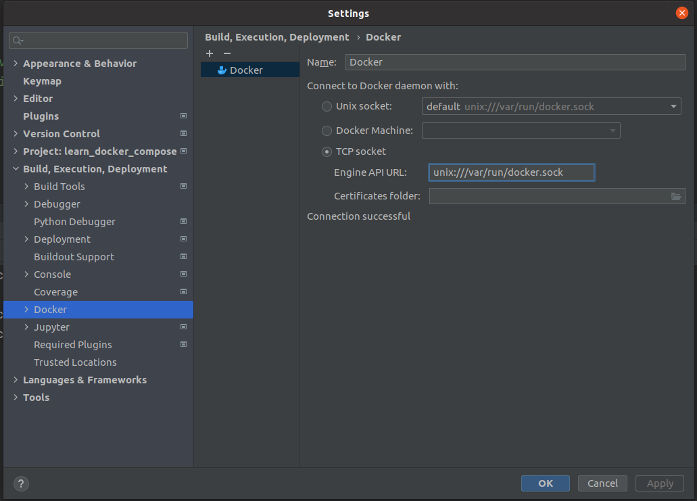
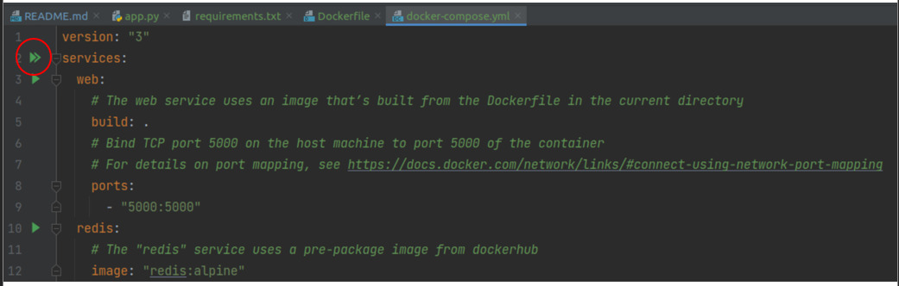

# Tutorial(s) on how to use docker compose

## Concepts
**Definition:** `docker-compose` is a tool for defining and running _a set_ of containers.

### Structure
Structure of the docker-compose process:
 
1. a _Dockerfile_ for the _encompassing application_.
2. a _docker-compose.yml_ file for defining the _services_.
3. execute command `docker-compose up`

### Daemon
The daemon creates a _Unix Socket_ accessible to all users of group `docker`.  
The daemon listens to processes sending requests (e.g. docker commands from a terminal)

### Unix Socket
A communication mechanism between processes running "on the same machine". For instance,
communication between the docker daemon and a terminal sending docker commands.

### Bind-Mount vs Volume
A _bind mount_ refers to mounting an existing directory of the host machine onto the container.
A _volume_ referst to creating a new directory in the docker storage area set aside on
the host machine, then mounting this directory onto the container.

(image from https://docs.docker.com/storage/bind-mounts/)
  

## Pycharm Usage

### settings
Seems that [pycharm assumes the docker daemon is bound to a TCP socket instead of a
Unix socket](https://intellij-support.jetbrains.com/hc/en-us/community/posts/360000174084-docker-compose-does-not-work-on-ubuntu-using-default-settings). To fool pycharm, we redirect the unix socket to the TCP socket:

After that, we can run `docker-compose up` from the double green arrow seen in the
docker-compose.yml tab:

